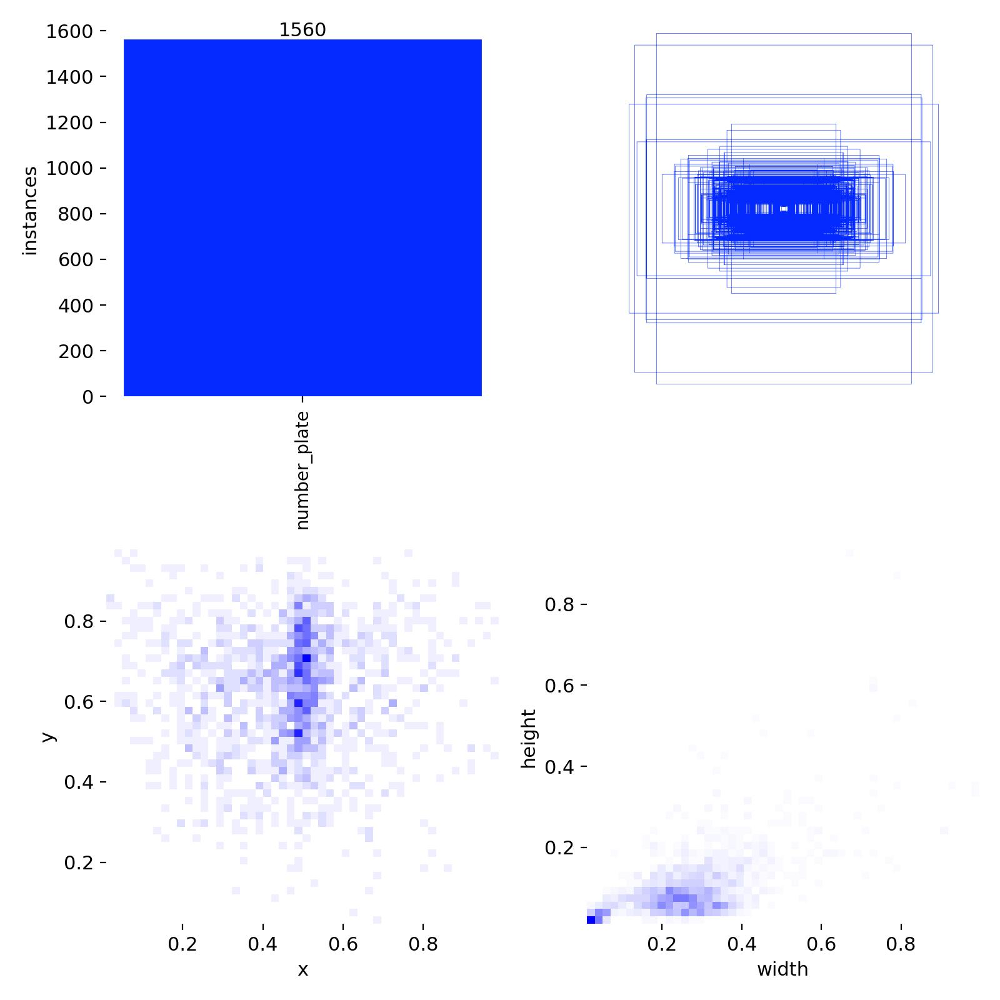
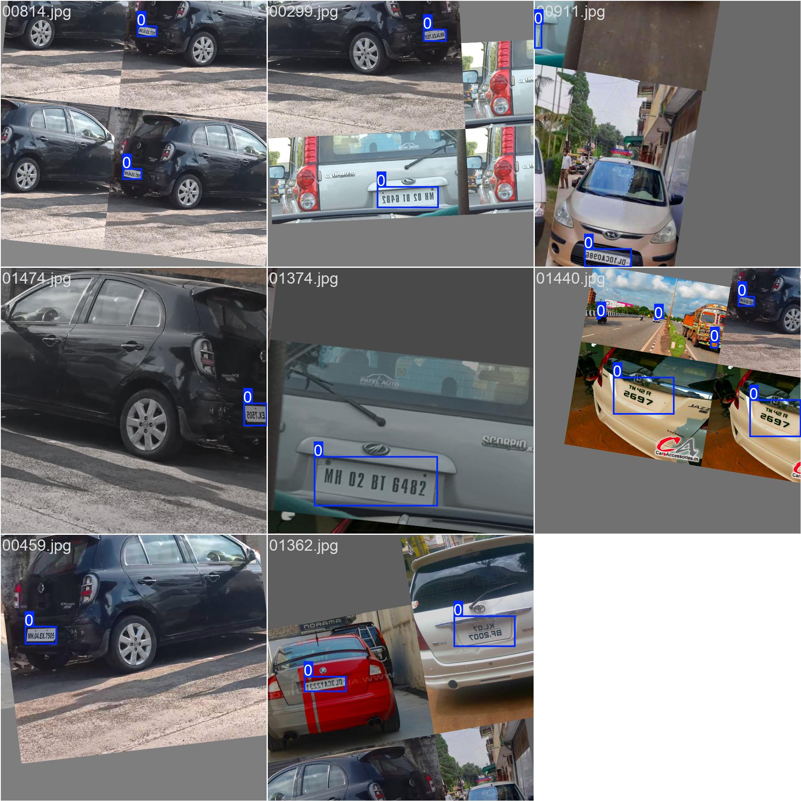
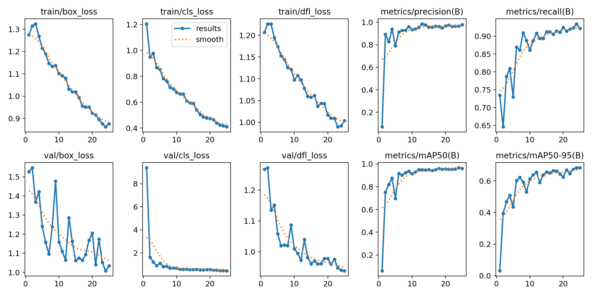
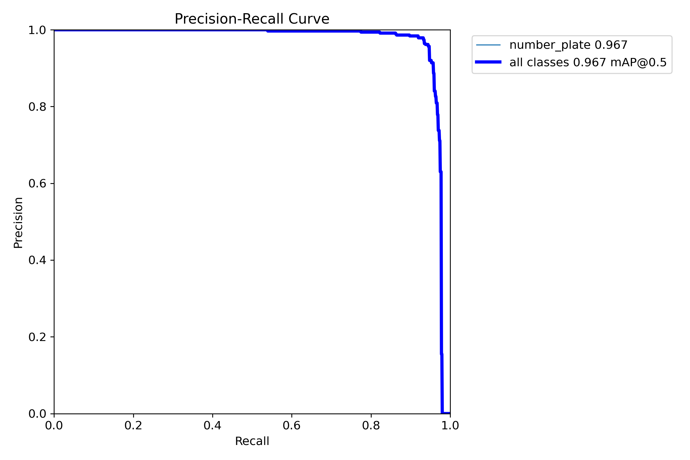
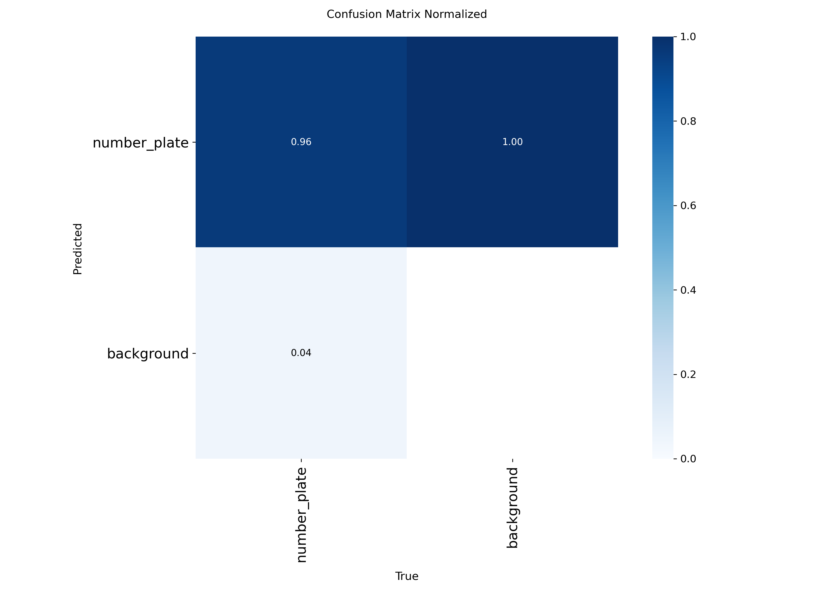
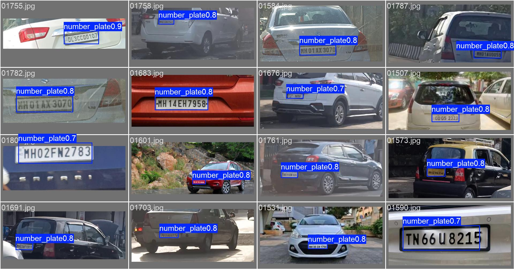

<div align="center">

# 🚗 Indian Number Plate Detector

**A YOLOv8 detector that finds number plates on Indian vehicles**

`mAP50 0.967` · `Precision 0.964` · `Recall 0.935` · `~40ms inference`

Built with Mayank

</div>

---

## The problem

Run a normal OCR engine on a photo of a car and it reads *everything* — the brand name, the dealer sticker, the text painted on the bumper. On a truck with `GOODS CARRIER` written across the back, OCR confidently returned `CARRIER`. On a tempo traveller with `Bhavana` on the side, it returned `BHAVANA`.

The registration number was right there in the frame. OCR just had no idea which part of the image to look at.

This model solves that first step. It takes a full vehicle photo and returns the exact coordinates of the number plate — nothing else. Crop to that box, and OCR only ever sees the plate.

---

## How it works

```
        ┌─────────────────────────┐
        │   Vehicle photo (any)   │
        └───────────┬─────────────┘
                    │
                    ▼
        ┌─────────────────────────┐
        │      Preprocessing      │
        │   letterbox → 640×640   │
        │      normalise 0-1      │
        └───────────┬─────────────┘
                    │
                    ▼
        ┌─────────────────────────┐
        │    YOLOv8m backbone     │
        │  25.9M params, 1 class  │
        └───────────┬─────────────┘
                    │
                    ▼
        ┌─────────────────────────┐
        │     Raw detections      │
        │  [x1,y1,x2,y2] + conf   │
        └───────────┬─────────────┘
                    │
                    ▼
        ┌─────────────────────────┐
        │      Post-filtering     │
        │   conf ≥ 0.30           │
        │   1.2 ≤ w/h ≤ 7.0       │
        │   area < 60% of frame   │
        └───────────┬─────────────┘
                    │
                    ▼
        ┌─────────────────────────┐
        │    Cropped plate(s)     │
        │     + 10% padding       │
        └───────────┬─────────────┘
                    │
                    ▼
              → ready for OCR
```

**Why the aspect ratio filter?** A real number plate is always wider than it is tall. Early runs produced boxes that covered half the vehicle or the entire frame — those all had a ratio under 1.2 or over 7.0, so a simple shape check removes them without touching real detections.

**Why the padding?** Cropping exactly on the predicted box clips the edge characters. `UP84AE9889` came back as `AE9889` — the state code got cut off. A 10% margin fixed it.

---

## Dataset

Two public Kaggle datasets, in two different annotation formats, merged into one.

| Source | Images | Format |
|--------|--------|--------|
| [Indian vehicle number plate — YOLO annotation](https://www.kaggle.com/datasets/deepakat002/indian-vehicle-number-plate-yolo-annotation) | 160 | YOLO `.txt` |
| [Indian vehicle license plate dataset](https://www.kaggle.com/datasets/saisirishan/indian-vehicle-dataset) | 1,698 | Pascal VOC `.xml` |
| **Merged total** | **1,858** | **1,959 boxes** |

Split 80/20 → **1,486 train** · **372 val**

**[⬇ Download the ready-to-train dataset (Google Drive)](https://drive.google.com/file/d/1Dg3ffjJb4U0LJoT8HXUwWiBv771r_cQy/view?usp=sharing)**

### What the data looks like



*Top-left: how many boxes in total. Top-right: every box drawn on top of each other — plates cluster in the lower-middle of the frame, which is exactly where you'd expect them on a vehicle. Bottom row: box centre positions and box sizes. Most boxes are tiny — plates typically occupy **1–4%** of the image area. That is what makes this a hard detection problem, and why a plate-specific model beats a generic one.*

### Datasets that did NOT work

Two other Kaggle datasets were tried and discarded:

- One contained only **close-up crops of plates** on white backgrounds — product photos from e-commerce listings. A model trained on those learns "a plate fills the whole frame" and finds nothing on a real vehicle photo.
- Another had **label files that didn't match the images** — two boxes annotated where only one plate existed.

Dataset quality mattered far more than dataset size here.

---

## Preparation

```bash
python prepare.py
```

One script handles everything:

1. **Converts** Pascal VOC `<bndbox>` (absolute pixel corners) to YOLO format (normalised centre + width/height)
2. **Validates** every box — rejects out-of-range coordinates, zero-area boxes, and boxes that fall outside the image bounds
3. **Verifies** every image actually opens (catches corrupt files before training crashes on them)
4. **Merges** both sources and shuffles with a fixed seed so the split is reproducible
5. **Renames** everything to a clean `00001.jpg` / `00001.txt` scheme
6. **Writes** `data.yaml`

```
Total images  : 1858
Total boxes   : 1959
Train         : 1486   (00001 - 01486)
Val           : 372    (01487 - 01858)
Bad boxes removed : 0
Corrupt images    : 0
```

---

## Training

```bash
python train.py
```

| Setting | Value | Why |
|---------|-------|-----|
| Base model | `yolov8m.pt` | balanced for 6 GB VRAM |
| Image size | 640 | |
| Batch | 8 | fits in 6 GB |
| Epochs | 25 | converged; `patience=10` |
| Optimizer | AdamW, lr 0.002 | auto-selected |
| Classes | 1 (`number_plate`) | |
| Hardware | RTX 3060 Laptop, 6 GB | |
| Time | ~20 minutes | |

### Augmentation



*A real training batch. Mosaic stitches four photos into one frame, then rotation (±10°), scaling (0.5), horizontal flip and HSV shift are applied on top. With only 1,858 images this is what stops the model from memorising the training set — it never sees the same image twice.*

---

## Results



*Left block: the three losses (box, classification, DFL) for train and val, all falling together — no divergence, so no overfitting. Right block: metrics climbing. **mAP50 went 0.06 → 0.75 → 0.82 in the first three epochs**, then converged around 0.96 by epoch 18.*

| Metric | Value | Meaning |
|--------|-------|---------|
| **mAP50** | **0.967** | overall detection quality at 50% IoU |
| mAP50-95 | 0.684 | averaged across stricter IoU thresholds |
| Precision | 0.964 | of the boxes it drew, 96% were real plates |
| Recall | 0.935 | of the plates present, it found 94% |

<table>
<tr>
<td width="50%"></td>
<td width="50%"></td>
</tr>
<tr>
<td align="center"><em>Precision–recall curve. The line stays flat near the top until recall passes ~0.9 — the model is confident and accurate across almost the entire operating range.</em></td>
<td align="center"><em>Confusion matrix. 97% of plates correctly detected; the small background cell is the occasional false positive on a bumper sticker or tail light.</em></td>
</tr>
</table>

### Predictions on unseen images



*Validation images the model never saw during training, with its own predictions drawn on. Plates are found at distance, at an angle, on bikes, cars and trucks alike.*

---

## Demo

```bash
pip install -r requirements.txt
streamlit run app.py
```

The Streamlit app shows:

- **Left** — the uploaded image with detections drawn, each plate cropped out separately, and the raw model output as JSON and as a table
- **Right** — a live pipeline view that lights up step by step as the image is processed, with inference timing and how many boxes survived filtering
- **Confidence slider** to see how the threshold changes what gets detected

---

## Use it in your own code

```python
from ultralytics import YOLO
import cv2

model = YOLO('plate_model.pt')
image = cv2.imread('car.jpg')
results = model(image, conf=0.30)[0]

for box in results.boxes:
    x1, y1, x2, y2 = map(int, box.xyxy[0])
    conf = float(box.conf[0])

    w, h = x2 - x1, y2 - y1
    if not (1.2 <= w / h <= 7.0):      # shape check
        continue

    pad_x, pad_y = int(w * 0.10), int(h * 0.10)
    crop = image[max(0, y1 - pad_y):y2 + pad_y,
                 max(0, x1 - pad_x):x2 + pad_x]
    # → send crop to OCR
```

---

## Files

```
plate_model.pt      trained weights (~50 MB)
app.py              Streamlit demo
prepare.py          format conversion, merge, validation, train/val split
train.py            training script
data.yaml           dataset config
assets/             training curves and sample outputs
```

---

## Limitations

- **Night photos with headlight glare** are the weakest case — the blown-out region around the lights washes out the plate
- **Single class** — this locates plates, it does not classify vehicle type
- **Detection only** — reading the characters is a separate problem, and a much harder one
- Trained on 1,858 images; more data would mostly help the edge cases

---

## What's next

- CRNN-based OCR trained specifically on plate crops, so the reader never produces non-plate text like `CARRIER` in the first place
- Multi-frame voting — in a live setting the camera sees the same vehicle several times, so agreement across frames can be used as a confidence signal

---

<div align="center">

Built with Mayank

</div>